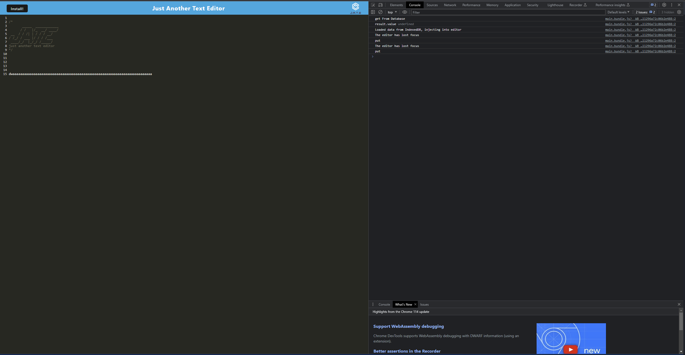

# textEditor

## Badges

## Description

- Motivation: My motivation for this project was to test my abilities with webpack
- Goal: To see how far I came from in the lessons on webpack
- Problems Solved: having a texteitor
- What I Learned: webpack is very much about theory and so it becomes very simple once you understand the theory

## Installation

node

## Usage

## Credits

N/A

## License

This program is done under the license: [MIT License](https://choosealicense.com/licenses/mit/)

## How To Contribute

## Questions

GitHub: https://github.com/Albikras

If you want to reach me with additional question click my email link here: krasniqi1287@gmail.com

## Links

heroku:

## Screenshot

